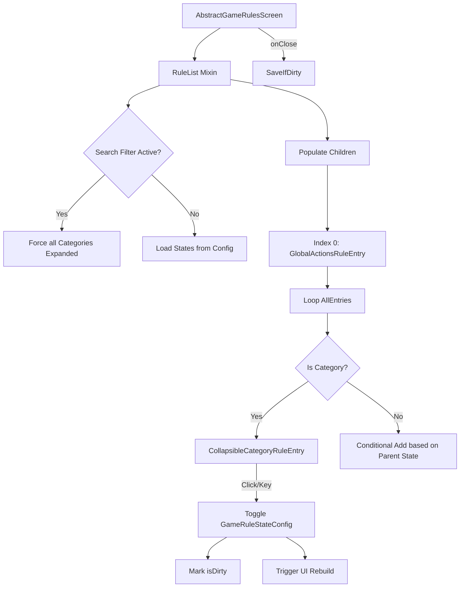

# Collapsible Game Rules Architecture

## System Overview

The mod enhances the vanilla `AbstractGameRulesScreen` by intercepting the rule list population and substituting standard category headers with interactive, stateful components.

## Module Responsibilities

### 1. UI Layer (`net.instantgratification.collapsiblegamerules.mixin`)
- **AbstractGameRulesScreenRuleListMixin**: The "Engine". It maintains a master list of all possible rule entries and manages the dynamic clearing/rebuilding of the visible list based on collapse states and search queries.
- **CollapsibleCategoryRuleEntry**: Handles the rendering of the category header, mouse interactions (left/right click), and keyboard events (Space, Enter, Arrows).

### 2. Specialized Components (`net.instantgratification.collapsiblegamerules.ui`)
- **GlobalActionsRuleEntry**: A unique entry pinned to the top of the list providing bulk expansion/collapse operations.

### 3. Persistence Layer (`net.instantgratification.collapsiblegamerules.GameRuleStateConfig`)
- Tracks a `Set<String>` of expanded category translation keys.
- **Throttling**: To avoid intensive disk I/O when users rapidly toggle categories, a `isDirty` flag is used. The `save()` operation is deferred until the screen is closed.

## Design Decisions

### Why Cached Entries?
Vanilla's `RuleList` re-queries the world game rules map on every filter change. To maintain predictable collapse states and high performance, we capture the result of `populateChildren` once and then use our own `allEntries` list for subsequent UI updates.

### Keyboard Navigation
The decision to map Left Arrow to Collapse and Right Arrow to Expand follows established Tree View UI patterns, providing a more "Pro" feel for keyboard-centric users.

### Smart Search
Forcing expansion during search ensures that players don't "miss" results hidden inside collapsed folders, resolving a common UX friction point in complex modpacks.
